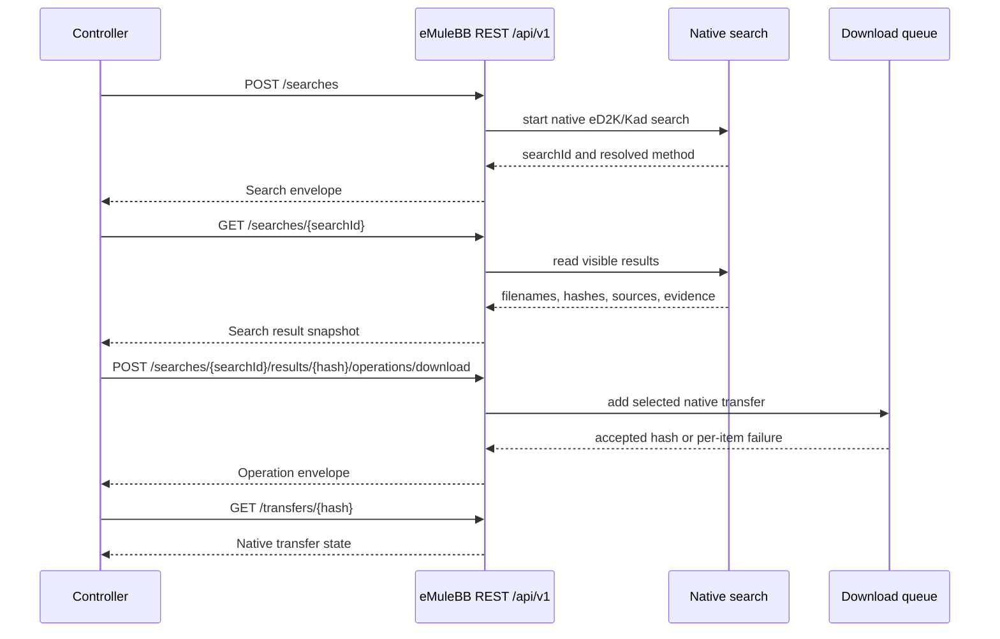

# Controllers And REST Guide

This guide explains how the eMuleBB client should be used with trusted local
controllers, automation, and compatibility adapters.

> **Controllers in the suite.** The forward eMuleBB Suite controller is
> **TrackMuleBB** (`emulebb/trackmulebb`), a generic `/api/v1` + capability
> consumer that drives any core by advertised capability. **aMuTorrent** is the
> browser-UI controller **bundled with the frozen `0.7.3` release** (legacy). The
> REST/adapter semantics on this page are the same regardless of which controller
> calls them — controllers are clients of the native contract, not part of it.
> Suite/forward setup: [SUITE-INSTALLER](../active/SUITE-INSTALLER.md).

For a task-first product walkthrough of the eMuleBB client with a controller,
Prowlarr, and selected Arr apps, start with the
[Stack Integration Guide](GUIDE-STACK-INTEGRATIONS.md). This page is the
controller behavior reference.

## Guide Boundary

Use this guide for semantics: REST trust model, lifecycle restrictions, native
resource ownership, adapter limits, typed errors, diagnostics, and unsupported
behavior. It explains what controller calls mean after setup exists.

Use [Stack Integration Guide](GUIDE-STACK-INTEGRATIONS.md) for setup recipes:
which fields to enter in aMuTorrent, Prowlarr, and selected Arr apps; which
helper script to run; and which manual proof flow to follow first.

## REST Is The Preferred Controller Path

eMuleBB exposes JSON REST under `/api/v1` through the embedded WebServer
listener. REST is the preferred automation surface. The legacy template web UI
is frozen pending removal and is not a supported controller surface.

Contract references:

- [REST API contract](../rest/REST-API-CONTRACT.md)
- [REST API quickstart](../rest/REST-API-QUICKSTART.md)
- [OpenAPI contract](../rest/REST-API-OPENAPI.yaml)
- [Adapter contracts](../rest/REST-API-ADAPTERS.md)

The OpenAPI document is the route and schema source of truth. Human guides
explain how to operate the surface safely.

## Bundled Script Examples

Suite bootstrap installs REST automation examples under
`<install-root>\examples\automation` when the release publishes the matching
automation examples asset. The examples are persisted repo assets packaged as
`automation-examples-<version>.zip`; they are not inline-generated by the
bootstrapper and are not part of the standalone core ZIP.

Use them as small reference clients for status reads, speed-limit updates,
search, and deliberate result download. They resolve REST bind information and
the API key from the suite manifest first, then from the eMuleBB profile
preferences, so they can be run from the suite root without duplicating secrets
on the command line.

## Trust Model

REST is for trusted local or controlled-network automation.

Use:

- API key authentication with `X-API-Key`
- deliberate bind address and port
- firewall rules matching the exposure policy
- a controlled network path
- redacted diagnostics when sharing support data

Do not expose REST broadly on untrusted networks. HTTPS protects transport on
the configured path, but it does not make broad exposure safe by itself.

## Local-Only Setup Recipe

Use this recipe for a controller on the same machine:

1. Finish normal desktop setup first.
2. Open `Preferences > Web Server`.
3. Enable the WebServer/REST listener.
4. Bind to localhost or the intended local-only address.
5. Use a strong API key/password.
6. Keep Windows Firewall closed to external clients unless deliberately
   exposing the listener.
7. Read `GET /api/v1/app` or another status route before attempting mutations.
8. Add mutations only after status and preferences reads work.

Local-only is the preferred default for automation. Use a broader bind only
when the operator controls the network path and firewall policy.

## Controlled-Network Setup Recipe

Use this recipe for a LAN or VPN controller path:

1. Choose the exact bind address or interface policy.
2. Choose a port and document it with firewall/router rules.
3. Configure allowed IPs when available.
4. Use HTTPS certificate material if the network path is not strictly local.
5. Use a strong unique API key/password.
6. Test status reads from the controller host.
7. Test one harmless read from each intended adapter.
8. Test one reversible mutation before enabling unattended workflows.

If the machine also uses P2P bind settings, keep them conceptually separate
from WebServer/REST bind settings. P2P listener binding and WebServer binding
are different surfaces.

## WebServer HTTPS And Certificates

REST uses the embedded WebServer listener. HTTPS therefore follows WebServer
certificate settings:

- `UseHTTPS` enables HTTPS behavior.
- `HTTPSCertificate` points to the certificate file.
- `HTTPSKey` points to the private-key file.
- `BindAddr`, `Port`, `AllowedIPs`, and firewall policy still control exposure.

The app can generate a WebServer certificate from the command line:

```powershell
emulebb.exe --generate-webserver-cert --cert webserver.crt --key webserver.key --host localhost --host 127.0.0.1
```

Generate certificates deliberately, store private keys with the profile or
operator-owned secret material, and keep controller API keys out of shared
logs.

## Native Behavior Remains Authoritative

Controllers must preserve eMule semantics:

- search network choice matters
- categories matter
- paused vs started adds matter
- delete and cancel operations are meaningful and potentially destructive
- completed files and incomplete parts are different resources
- source, fake, trust, comment, and category data should not be discarded
- local path ownership belongs to the native profile

When a controller presents eMuleBB as a generic download client, the adapter
must still map back to native behavior correctly.

## Native REST Surface

Native `/api/v1` covers the supported controller model:

- app state, preferences, shutdown, and diagnostics
- global status, snapshots, and stats
- categories
- transfers, transfer details, and transfer sources
- shared files and shared directories
- uploads and upload queue
- servers
- Kad
- searches and search results
- friends
- logs

Use OpenAPI for exact route names, request bodies, response envelopes, and
error shapes.

## Preference Mutation

REST exposes a curated mutable subset of preferences. It is intentionally not a
general `preferences.ini` editor.

Rules:

- use `GET /api/v1/app/preferences` to read the REST preference subset
- use `PATCH /api/v1/app/preferences` only for documented mutable fields
- unsupported names are rejected
- out-of-range values are rejected
- exact mutable field names are documented in OpenAPI and summarized in
  [Preferences Guide](GUIDE-PREFERENCES.md)

Direct config-file edits are a separate maintenance path, not REST behavior.

## Search And Download Recipe

For native REST search workflows:

1. Confirm the app is connected to the intended network.
2. Create a search with the intended method and type.
3. Read the search session until results are available.
4. Inspect filename, size, source, comment, fake/trust, and category data.
5. Download a selected result through the documented operation route.
6. Track the resulting native transfer by hash.
7. Use pause, resume, stop, or delete operations deliberately.

Do not discard native metadata just because a controller has a simpler UI.
eMule search quality depends on several signals, not only on a title match.



## Transfer Management Recipe

For controller-managed transfers:

1. List transfers and identify the hash.
2. Read transfer detail before destructive actions.
3. Preserve category and paused/started semantics.
4. Use explicit delete confirmation when files may be removed.
5. Use source operations only when the controller has a stable source selector.
6. Treat failed add-transfer items as real failures, not partial success.
7. Reconcile controller state with native desktop state after batch actions.

Native eMule distinction between cancel, delete, stop, pause, and completed
cleanup matters. Compatibility adapters must not flatten those into one action.

## Shared Files And Directories Recipe

For sharing automation:

1. Read current shared directories.
2. Replace shared directories only with a complete intended set.
3. Reload shared directories after external config changes.
4. Read shared files with paging where applicable.
5. Use explicit confirmation for destructive shared-file removal.
6. Keep local path visibility and privacy in mind before exposing data through
   controllers.

The desktop app owns shared-library scanning, hashing, and cache validation.
Controllers request state changes; they do not own the scan engine.

## Controller Behavior (TrackMuleBB / aMuTorrent)

A controller integration uses native REST and adapter behavior. **TrackMuleBB**
(forward) reads `GET /api/v1/capabilities` and calls only advertised operations;
**aMuTorrent** (frozen `0.7.3` bundle) is a fixed REST/UI consumer. Either way,
prove the basics before running long workflows:

- app status reads correctly
- preferences read correctly
- search dispatch works
- add/download flow reaches the eMuleBB client
- upload and queue data remain meaningful when consumed
- typed error envelopes are handled

If browser/UI tests fail, compare the controller's assumptions with the current
OpenAPI contract and live REST smoke evidence.

A controller should treat the desktop app as the authority. It may present a
modern workflow, but category, search, transfer, shared-file, upload-queue, and
lifecycle semantics still come from native eMuleBB state.

For field-level setup of the bundled aMuTorrent controller and package helper
usage, use [Stack Integration Guide](GUIDE-STACK-INTEGRATIONS.md#amutorrent-legacy-073-bundle).

## Arr, qBit, And Torznab Adapter Behavior

Adapter surfaces let Arr-family tools, qBittorrent-compatible workflows, and
Torznab consumers talk to eMuleBB. These are compatibility layers, not the
native contract.

Expectations:

- native `/api/v1` remains authoritative
- qBit-compatible actions preserve eMule delete/category semantics
- Torznab search family mapping resolves to supported native search types
- adapter errors remain typed and predictable
- adapter routes should not invent behavior the native app cannot represent

For Arr-style automation, validate both search/indexer behavior and download
client behavior. A working Torznab search does not prove transfer management is
correct.

The qBittorrent-compatible download-client surface is an eMuleBB/eD2K subset.
It is meant for Arr clients consuming eMuleBB Torznab results and adding
`ed2k://` URLs back to eMuleBB. It is not a full qBittorrent clone: `.torrent`
uploads, BitTorrent magnet links, HTTP torrent URLs, tracker/RSS APIs, peer
management, sync APIs, and `hashes=all` mutations are outside the supported
controller contract.

Manual Prowlarr/Arr fields, category conventions, and package helper
scripts live in [Stack Integration Guide](GUIDE-STACK-INTEGRATIONS.md). Those
scripts are conveniences over the same documented adapter surfaces; they do not
add a separate protocol.

## Lifecycle

REST has lifecycle restrictions. During startup and shutdown, unsafe operations
can be rejected to protect native app state.

Controllers should:

- handle lifecycle errors as retry/stop conditions
- avoid hammering during startup
- stop mutating after shutdown begins
- tolerate temporary unavailability during profile or listener changes
- retry reads more freely than mutations

Unattended controllers should use bounded retry with backoff. A tight retry loop
during startup can make diagnostics harder.

## Concurrency And Request Limits

The embedded WebServer is a single-flight listener by design: it serves one
HTTP connection at a time across every surface behind it (`/api/v1`, the
qBittorrent-compatible `/api/v2` adapter, the Torznab adapter, and the frozen
legacy templates). This is a deliberate resource and safety budget, not a
tuning gap. Accepted web workers still share request and session state and
reach broad main-thread eMule objects, so the listener is kept single-flight
until that state is made per-connection. Controllers should treat this as a
stable part of the contract rather than something to defeat with parallelism.

What this means in practice:

- **One in-flight request wins; others are told to wait.** While a request is
  being served, a second connection is refused at accept time with
  `503 Service Unavailable` carrying `Retry-After: 10`, `Cache-Control:
  no-store`, and `Connection: close`. The `503` is the normal busy signal, not
  an error to escalate.
- **Long operations hold the slot.** A native search dispatched through REST or
  through the Torznab bridge occupies the single slot until it returns. Torznab
  generic searches observe native results for about 12 seconds; movie and TV
  searches observe for about 45 seconds. For that whole window, other
  controllers polling the same listener receive `503`.
- **The Torznab bridge adds its own single-flight guard.** Only one native
  search runs at a time behind the adapter. A caller that arrives while a search
  is in flight waits briefly (about 15 seconds) for the slot, then either
  receives a cached page or a `503` busy response. Successful result sets are
  cached for about 10 minutes, so repeated identical queries are served from
  cache instead of starting another native search.
- **Each request uses its own connection.** Responses close the connection
  (`Connection: close`); the listener does not keep connections alive for reuse.
  Open a fresh connection per request rather than expecting HTTP keep-alive or
  pipelining.

Controllers must therefore:

- honor `Retry-After` and use bounded backoff on `503`, exactly as for lifecycle
  unavailability above
- stagger independent pollers (for example aMuTorrent status polling, Prowlarr,
  and a second Arr app) instead of issuing concurrent bursts at the same listener
- expect that issuing a search makes the listener briefly busy for other callers,
  and size poll intervals with that in mind
- treat a `503` with `Retry-After` as transient and retryable, distinct from a
  `4xx` request error that should not be retried unchanged

Request size and timeout limits round out the transport contract:

- **Request headers** are capped at 64 KB and the **request body** at 16 MB. A
  request that exceeds either limit has its connection dropped without a normal
  HTTP status, so keep request bodies well under the body cap.
- **Idle accepted connections** are closed after about 30 seconds of socket
  inactivity. Send the full request promptly after connecting; do not hold an
  open connection waiting to send.

These limits are intentional and shared by all surfaces behind the listener.
They are not per-route tunables and do not vary by adapter.

## Legacy WebServer

The legacy WebServer template UI is frozen pending removal. It receives no
product support, no feature work, and no controller compatibility guarantees.

REST and the documented qBit/Torznab adapters are the supported controller
surfaces. REST should remain useful even when legacy templates are absent.

## Diagnostics

For controller failures, collect:

- route, method, status code, and response body
- whether the route exists in OpenAPI
- app lifecycle state
- WebServer enabled/bind/port settings
- API key configuration
- adapter name and version, when applicable
- recent REST and app logs
- redacted diagnostic snapshot

Do not share API keys, private keys, or full raw profile dumps unless the
recipient is trusted and the exposure is understood.

### Unsafe Diagnostic REST

The native REST contract includes diagnostic dump and crash-test routes:

- `POST /api/v1/diagnostics/dumps`
- `POST /api/v1/diagnostics/crash-tests`

These endpoints are intentionally unsafe for ordinary controller exposure. They
are disabled unless diagnostic REST endpoints are explicitly enabled, and they
require request confirmation fields: `confirmDump: true` or
`confirmCrash: true`.

Keep them localhost-only or on a tightly controlled operator network. Use dump
capture for release proof and support evidence; use crash tests only for
diagnostic harnesses. Do not expose these routes through broad LAN, public
reverse-proxy, or Arr-controller paths.

For snapshot, dump, and redaction details, see
[Diagnostics Guide](GUIDE-DIAGNOSTICS.md).

## Troubleshooting

REST unavailable:

1. Confirm WebServer/REST is enabled.
2. Check bind address and port.
3. Check firewall and allowed IP policy.
4. Confirm the app is not starting or shutting down.
5. Try a local status request from the same machine.

Auth failure:

1. Confirm the current API key.
2. Confirm the `X-API-Key` header is sent.
3. Check whether the profile regenerated an empty/missing key.
4. Remove stale controller secrets after a profile restore.

Route or schema failure:

1. Compare the route with OpenAPI.
2. Check field casing exactly.
3. Remove unsupported aliases.
4. Confirm adapter mapping is not using stale qBit/Torznab assumptions.

Mutation rejected:

1. Check lifecycle state.
2. Check whether the target resource still exists.
3. Check destructive confirmation fields.
4. Check native state in the desktop app.
5. Retry only if the response indicates a temporary condition.
