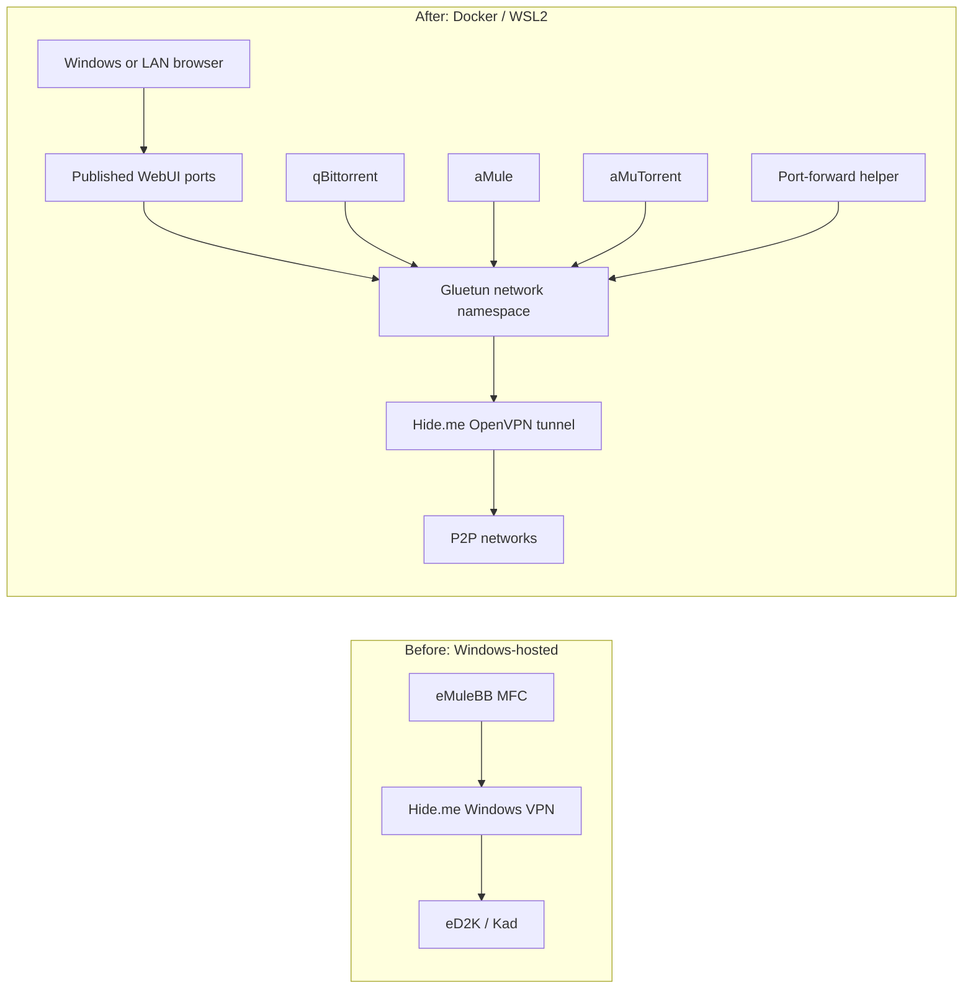

# Moving A Windows P2P Stack Behind Docker And Gluetun

This guide describes the operating pattern used to move a Windows-hosted
eMuleBB MFC and Hide.me setup into Docker: Gluetun owns the VPN tunnel and
firewall, while aMule, aMuTorrent, qBittorrent, and a port-forward helper share
its network namespace.

> **Operator reference, not a product.** This is a reusable deployment pattern,
> not an officially supported eMuleBB stack. The eMuleBB MFC client remains in
> its Windows maintenance lane. aMule is a different, stock-compatible eD2K/Kad
> client, and aMuTorrent is the frozen controller that accompanied eMuleBB
> `0.7.3`.

The snippets are deliberately incomplete. They illustrate the boundaries that
matter without publishing an operator's credentials, addresses, storage layout,
or complete private Compose project.

## Why Move The VPN Boundary

The earlier layout ran eMuleBB MFC directly on Windows while a native Hide.me
connection carried its P2P traffic. That kept the desktop client and VPN
lifecycle coupled to one host. Adding another P2P client also meant reasoning
about Windows routes, application bindings, and VPN behavior again.

The Docker layout makes the network boundary explicit:

- Gluetun is the only service that owns `/dev/net/tun` and `NET_ADMIN`.
- Every traffic-producing client joins Gluetun's network namespace.
- Clients have no independent Docker network attachment or direct fallback
  route.
- Web interfaces are opened separately from peer ports.
- One helper owns dynamic VPN port mappings for all participating clients.
- Persistent configuration and downloads remain outside the containers.

The change is operational rather than a statement that aMule replaces eMuleBB.
It moves the daily multi-protocol P2P workload into a container stack while the
Windows MFC client remains available for maintenance and historical use.

## Before And After



On WSL2, Docker publishes selected WebUI ports inside the WSL virtual machine.
Windows then forwards only those control-plane ports to a trusted LAN address.
Peer ports stay on the VPN side and are not exposed through Windows.

## The Safety Contract

Treat these properties as the design contract, not optional tuning:

1. **Only Gluetun owns network privileges.** Traffic clients do not receive
   `NET_ADMIN`, `/dev/net/tun`, or their own Compose network.
2. **Every traffic client uses `network_mode: service:gluetun`.** A client must
   not also declare `ports`, `networks`, or an independent VPN route.
3. **Control and peer ports are different firewall classes.** WebUIs belong in
   `FIREWALL_INPUT_PORTS`; peer listeners belong in
   `FIREWALL_VPN_INPUT_PORTS`.
4. **The stack is fail-closed.** Losing OpenVPN must leave Gluetun's firewall in
   place. It must never move a client onto an ordinary bridge as a recovery
   shortcut.
5. **Tunnel replacement drains consumers first.** Recreating Gluetun while
   clients still reference its old namespace can strand them in a stale
   namespace.
6. **Secrets and state are external.** Credentials are ignored files or Docker
   secrets; profiles and downloads are persistent mounts.
7. **IPv6 is either designed and tested end to end or disabled end to end.**
   The deployment described here is intentionally IPv4-only.

## Compose Shape

The central Compose relationship is small. Only Gluetun publishes ports; each
client attaches to it with `network_mode`.

```yaml
services:
  gluetun:
    image: qmcgaw/gluetun:v3.41.3
    cap_add:
      - NET_ADMIN
    devices:
      - /dev/net/tun:/dev/net/tun
    environment:
      VPN_SERVICE_PROVIDER: custom
      VPN_TYPE: openvpn
      OPENVPN_CUSTOM_CONFIG: /gluetun/custom.conf
      HEALTH_RESTART_VPN: "off"
      DNS_UPSTREAM_IPV6: "off"
      FIREWALL_INPUT_PORTS: "8080,4000"
      FIREWALL_VPN_INPUT_PORTS: "42150,42162,42165,42172"
    sysctls:
      net.ipv6.conf.all.disable_ipv6: "1"
      net.ipv6.conf.default.disable_ipv6: "1"
    volumes:
      - ./private/custom.conf:/gluetun/custom.conf:ro
      - ./private/provider-ca.pem:/gluetun/provider-ca.pem:ro
    secrets:
      - openvpn_user
      - openvpn_password
    ports:
      - "127.0.0.1:18080:8080" # qBittorrent WebUI
      - "127.0.0.1:14000:4000" # aMuTorrent WebUI
    restart: "no"

  qbittorrent:
    image: lscr.io/linuxserver/qbittorrent:5.2.4
    network_mode: service:gluetun
    depends_on:
      gluetun:
        condition: service_healthy
    volumes:
      - ./state/qbittorrent:/config
      - ./downloads:/downloads
    restart: "no"

  amule:
    image: example.invalid/operator/amule:3.1.0
    network_mode: service:gluetun
    depends_on:
      gluetun:
        condition: service_healthy
    volumes:
      - ./state/amule:/config
      - ./downloads:/downloads
    restart: "no"

secrets:
  openvpn_user:
    file: ./private/openvpn_user
  openvpn_password:
    file: ./private/openvpn_password

networks:
  default:
    enable_ipv6: false
```

`example.invalid` is intentional: build or select an aMule image whose source,
version, and configuration you control. Do not paste an unreviewed image into a
network-privileged stack.

The published ports above bind to loopback. For LAN access, use an explicit
trusted host address and a host firewall rule rather than changing them to an
unreviewed wildcard exposure.

### Add aMuTorrent without another network path

aMuTorrent talks to aMule through loopback because both containers share
Gluetun's namespace. The aMule External Connections port does not need to be
published on the host.

```yaml
services:
  amutorrent:
    image: example.invalid/operator/amutorrent:3.9.7
    network_mode: service:gluetun
    depends_on:
      gluetun:
        condition: service_healthy
      amule:
        condition: service_healthy
    environment:
      AMULE_ENABLED: "true"
      AMULE_HOST: 127.0.0.1
      AMULE_PORT: "4712"
      QBITTORRENT_ENABLED: "false"
      WEB_AUTH_ENABLED: "true"
    volumes:
      - ./state/amutorrent:/app/data
    restart: "no"
```

Keep the EC password and WebUI credentials in ignored secret files or an
ignored environment file. Disabling aMuTorrent category synchronization is
also useful when category destinations must not become implicit aMule shares.

### Bind qBittorrent to the tunnel

Namespace sharing already removes qBittorrent's direct Docker route. Binding
qBittorrent itself to `tun0` adds a useful invariant and makes configuration
drift observable. In the persistent qBittorrent configuration, retain both the
interface type and name:

```ini
Session\Interface=tun0
Session\InterfaceName=tun0
```

A health check can require those values before probing the local Web API:

```yaml
healthcheck:
  test:
    - CMD-SHELL
    - >-
      grep -Fqx 'Session\Interface=tun0' /config/qBittorrent/qBittorrent.conf &&
      grep -Fqx 'Session\InterfaceName=tun0' /config/qBittorrent/qBittorrent.conf
  interval: 30s
  timeout: 5s
  retries: 5
```

An unhealthy client is a signal to the operator; it is not permission to
bypass Gluetun.

## Hide.me And Dynamic Port Forwarding

The network model is provider-neutral, but Hide.me adds several concrete
requirements:

- Use the provider's port-forwarding authentication mode when establishing the
  VPN session. At the time this stack was validated, that meant the documented
  `@pf` username suffix.
- Treat the VPN gateway's assigned external ports as authoritative. They may
  differ from the clients' requested internal ports.
- NAT-PMP is the preferred mapping protocol for this deployment.
- MiniUPnP can be a fallback, but automatic SSDP discovery may reject the
  provider's off-subnet IGD response. A provider-documented explicit control
  URL avoids depending on discovery.
- Disable each application's competing automatic port mapper when a dedicated
  helper owns the mappings.

Provider behavior can change. Reconfirm Hide.me's current authentication and
port-forwarding documentation before recreating the setup.

A helper belongs in the same network namespace and should degrade without
weakening privacy:

```yaml
services:
  port-forward:
    image: example.invalid/operator/p2p-port-forward:1
    network_mode: service:gluetun
    depends_on:
      gluetun:
        condition: service_healthy
    environment:
      PORT_FORWARD_LEASE_SECONDS: "86400"
      PORT_FORWARD_RETRY_SECONDS: "60"
      PORT_FORWARD_NATPMP_ATTEMPTS_BEFORE_FALLBACK: "3"
      QBITTORRENT_TCP_PORT: "42150"
      AMULE_TCP_PORT: "42162"
      AMULE_SERVER_UDP_PORT: "42165"
      AMULE_KAD_UDP_PORT: "42172"
    restart: "no"
```

The proven helper requests 24-hour leases, renews them halfway through their
lifetime, pins the first successful mapping protocol for the current tunnel
session, and writes its state atomically. A missing mapping is reported and
retried, but it does not restart the clients or alter the VPN firewall.

Mapping failure normally means Low ID, fewer inbound peers, or reduced DHT
reachability. It is not evidence that traffic escaped the tunnel. Validate the
protocol result as well as the mapper result: for aMule, High ID and a healthy
Kad state are stronger evidence than a generic third-party TCP probe alone.

## Keep The IPv4 Boundary Complete

Disabling IPv6 on one layer is not sufficient. The IPv4-only deployment uses
all of these controls:

- `enable_ipv6: false` on the Compose network,
- IPv6-disable sysctls in Gluetun,
- `DNS_UPSTREAM_IPV6=off`,
- an IPv4 OpenVPN transport such as `udp4`, and
- custom OpenVPN filters that ignore pushed IPv6 addresses, routes, redirects,
  and DNS options.

After startup, fail validation if the shared namespace contains an unexpected
IPv6 address or route. Do not silently continue with a partially disabled IPv6
configuration.

## Windows And WSL2 Control-Plane Access

Docker Desktop or Docker Engine inside WSL2 publishes WebUI ports to the WSL
virtual machine. Its NAT address can change, so a Windows-side lifecycle script
can refresh narrowly scoped forwarding rules during `up` and remove them during
`down`.

The underlying Windows operation has this shape:

```powershell
netsh interface portproxy add v4tov4 `
    listenaddress=<WINDOWS_LAN_IP> listenport=<LAN_WEBUI_PORT> `
    connectaddress=<CURRENT_WSL_IP> connectport=<WSL_WEBUI_PORT>
```

Pair every forwarding rule with a Windows Firewall rule restricted to the
trusted LAN or an explicit trusted CIDR. Do not forward peer ports: WebUIs are
host/LAN control traffic, while eD2K, Kad, and BitTorrent listeners belong on
the VPN interface.

For reliable lifecycle handling, the Windows wrapper should:

- serialize `up`, `down`, and recovery operations with one machine-wide lock,
- use one absolute deadline per operation,
- refresh WSL forwarding only after the target address is known,
- remove forwarding and keepalive state even when WSL path translation fails,
- retain an operator-readable status record outside the repository, and
- keep WSL alive only while the stack is intentionally running.

These are wrapper design requirements, not a requirement to copy any private
PowerShell implementation.

## Start And Verify In Layers

Render the configuration before creating containers:

```bash
docker compose config >/dev/null
```

Start Gluetun first and wait for it to become healthy:

```bash
docker compose up -d gluetun
docker compose ps gluetun
docker compose logs --tail=100 gluetun
```

Then start the forwarder and clients:

```bash
docker compose up -d port-forward qbittorrent amule amutorrent
docker compose ps
```

Verify the route and tunnel inside the shared namespace:

```bash
docker compose exec gluetun ip -4 address show tun0
docker compose exec gluetun ip -4 route
docker compose exec gluetun wget -qO- https://ipinfo.io/ip
```

Confirm the traffic clients really reference Gluetun's namespace:

```bash
docker inspect --format '{{.HostConfig.NetworkMode}}' \
  "$(docker compose ps -q qbittorrent)"
docker inspect --format '{{.HostConfig.NetworkMode}}' \
  "$(docker compose ps -q amule)"
```

Both results should be the same `container:<id>` target. Also verify that only
Gluetun declares published ports and that the expected peer ports listen inside
the shared namespace:

```bash
docker compose ps
docker compose exec gluetun ss -lntup
```

Finally, verify application behavior: qBittorrent should report `tun0`, aMule
should connect to an eD2K server and Kad, and the forwarding helper should show
current TCP and UDP leases.

## Prove Fail-Closed Behavior

Perform this only in a maintenance window with no important active transfers.
Record the VPN address first, stop Gluetun without changing any client network
configuration, and confirm that a traffic client cannot reach a public-IP
endpoint:

```bash
docker compose exec gluetun wget -qO- https://ipinfo.io/ip
docker compose stop gluetun
docker compose exec qbittorrent curl --max-time 10 https://ipinfo.io/ip
```

The final command must fail. If it returns the host's ordinary public address,
stop the stack and repair the topology before resuming P2P traffic.

Start the same Gluetun container again, wait for health, and verify that the VPN
address returns:

```bash
docker compose start gluetun
docker compose ps gluetun
docker compose exec gluetun wget -qO- https://ipinfo.io/ip
```

This checks a stopped tunnel. Recreating the Gluetun container is a different
operation and requires the drain procedure below.

## Recover Without A Stale Namespace

Do not force-recreate Gluetun underneath live consumers. Stop the consumers,
replace Gluetun, wait for health, and then recreate or start the consumers so
that they join the current namespace:

```bash
docker compose stop amutorrent amule qbittorrent port-forward
docker compose up -d --force-recreate gluetun
docker compose ps gluetun
docker compose up -d port-forward qbittorrent amule amutorrent
```

For automatic recovery, require a sustained failure rather than reacting to a
single synthetic Internet probe. The deployed pattern waits for continuous
tunnel failure, limits retry frequency, enforces a cooldown, and leaves traffic
clients stopped if refresh cannot establish a healthy replacement. Port-mapping
or external reachability failures alone do not trigger VPN replacement.

`restart: "no"` is intentional in this operator-controlled layout. It prevents
Docker from silently defeating maintenance or host skip policies. A different
restart policy can be valid, but it must preserve the same namespace, drain,
and fail-closed rules.

## Move State Deliberately

Do not point new containers at mutable Windows profiles on the first run.

- Audit the old profile while the Windows client is stopped.
- Copy into a staging directory and rewrite Windows paths to stable container
  paths.
- Back up every destination file that will be replaced.
- Publish the staged profile atomically only after validation.
- Mount qBittorrent's profile writable only in qBittorrent; give audit or
  management tools read-only access.
- Keep incomplete, completed, shared, and configuration mounts explicit.
- Import compatible hash metadata only with a client-specific tool that can
  merge rather than blindly overwrite newer state.

This migration preserves useful state without treating eMuleBB MFC and aMule
profiles as interchangeable formats.

## Where emulebb-rust Fits

`emulebb-rust` `0.1.0-beta.1` is the active experimental eMuleBB development
lane and has its own
[Gluetun Compose example](https://github.com/emulebb/emulebb-rust/blob/main/packaging/docker/compose.gluetun.example.yaml).
That example uses the same central pattern—Gluetun owns the namespace and the
Rust client binds P2P to `tun0`—but it is independent of the aMule/aMuTorrent
deployment described here. The published beta is not a production-readiness
claim and should not be presented as already deployed in this stack.

## Related Guides

- [eMuleBB Setup Guide](GUIDE-SETUP.md) for the maintained Windows client.
- [eMuleBB Network Guide](GUIDE-NETWORK.md) for eD2K/Kad ports, High ID, and
  firewall concepts.
- [Running eMuleBB On macOS And Linux](GUIDE-CROSS-PLATFORM.md) for the product
  distinction between MFC, aMule, and emulebb-rust.
- [Stack Integration Guide](GUIDE-STACK-INTEGRATIONS.md) for the historical
  Windows eMuleBB/aMuTorrent controller path.
