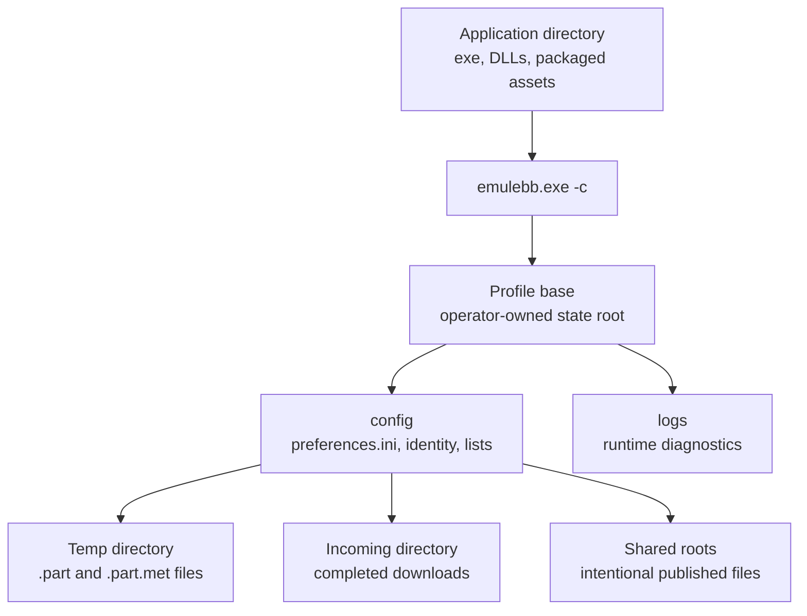

# eMuleBB Setup Guide

This guide covers practical setup for eMuleBB. It complements the
[Product Guide](GUIDE-EMULEBB.md), which remains the user-manual entry point.

## Install Model

Keep the application, profile, temp, incoming, and shared directories separate.
This makes upgrades, rollback, troubleshooting, and disk-space protection
predictable.

| Location | Purpose |
|---|---|
| Application directory | Executable, bundled runtime assets, skins, toolbar assets |
| Config/profile directory | Identity, preferences, server/Kad state, lists, logs, and sidecars |
| Temp directory | Incomplete `.part` and `.part.met` files |
| Incoming directory | Completed downloads |
| Shared directories | User-selected publish roots |



Do not run multiple eMule-family clients against the same live profile. Before
reusing an existing profile, close all clients and copy the full config
directory as a rollback backup.

## Choose Directories

Use stable paths that will still exist after reboot:

- Put the application under a normal install or unpack directory.
- Put the config/profile directory somewhere writable by the user account that
  runs eMuleBB.
- Put temp files on a fast, reliable local disk with enough free space.
- Put incoming files on the final storage volume when possible.
- Add shared directories deliberately, especially for large libraries.

Avoid using removable drives for temp files unless they are always present
before the app starts. Avoid network paths for temp files. Network paths may be
reasonable for selected shared directories, but they are slower and less
predictable than local NTFS volumes.

For long paths, use modern Windows long-path support and avoid deeply nested
library layouts until the profile is known to work. See
[Long Path Guide](GUIDE-LONGPATHS.md).

## New Profile Recipe

Use this path for a clean first profile:

1. Start eMuleBB with a new config/profile directory.
2. Open `Preferences > Directories`.
3. Choose incoming and temporary directories.
4. Open `Preferences > Connection`.
5. Set TCP and UDP ports.
6. Leave bind settings empty unless you need a specific interface or address.
7. Enable UPnP only when the router and local policy allow it.
8. Connect to trusted eD2K and/or Kad bootstrap sources.
9. Add one small shared directory and verify it on the Shared Files page.
10. Run a small search or add a known safe link before scaling up.

The legacy first-run connection wizard is a frozen surface. Treat the
Preferences pages and the product guides as the supported setup path.

## Existing Profile Recipe

Use this path when moving from stock eMule or another eMule-family build:

1. Close all eMule-family clients.
2. Back up the full config directory, not just `preferences.ini`.
3. Keep temp and incoming paths stable when possible.
4. Start eMuleBB once without controllers or automation.
5. Verify connection state, downloads, shared files, categories, and logs.
6. Let eMuleBB create branch-specific sidecars and caches before heavy use.
7. Re-enable controllers, automation, and large sharing only after the profile
   looks healthy.

Common profile files include:

- `preferences.ini` and `preferences.dat`
- `server.met` and `nodes.dat`
- `known.met`, `known2_64.met`, and `cancelled.met`
- `Category.ini`
- `ipfilter.dat` and `addresses.dat`
- `shareignore.dat` and `shareddir.dat`
- monitored-share files and shared-cache sidecars
- active `.part.met` files for incomplete downloads

For `.met` and `.dat` roles, structures, and recovery priority, use the
[Persistence Files](GUIDE-PERSISTENCE-FILES.md) reference.

If the old profile has stale paths, fix directories before starting downloads.
If the old profile has broad shared roots, let scanning finish before judging
performance.

## Isolated Profile Recipe

Use `-c <base-dir>` when you need a separate test, live, or operator profile:

```powershell
emulebb.exe -c C:\eMuleBB-Profiles\live
```

The path must be an absolute canonical Windows path. eMuleBB creates the base
directory, `config`, and `logs` when they are missing. The effective
preferences file is `config\preferences.ini` under that base. If that file
already exists and contains `IncomingDir` or `TempDir`, those paths take
precedence over the clean-profile defaults. Do not point two running clients at
the same base directory.

An isolated base is useful for:

- testing a new package without touching a production profile
- running a live proof profile with controlled inputs
- reproducing a support problem with a copy of a profile
- separating controller/API experiments from daily use

Keep profile backups outside the live base directory so they are not mistaken
for active config files.

## Command-Line Startup

The normal startup path is the desktop executable with the selected profile.
Command-line options are for controlled profile isolation, automation, support,
and WebServer certificate maintenance.

```text
emulebb.exe [options] [ed2k-link|magnet-link|collection-file|command]
```

Supported options:

| Option | Use |
|---|---|
| `--help`, `-h`, `/?` | Print usage and exit |
| `-c <base-dir>` | Use an isolated eMule base directory |
| `-ignoreinstances` | Start without the running-instance guard unless input must be forwarded |
| `-AutoStart` | Mark the session as automatic startup |
| `-assertfile` | Debug-build assertion logging helper |
| `--generate-webserver-cert` | Generate a WebServer TLS certificate and exit |
| `--cert <path>` | Certificate output path for certificate generation |
| `--key <path>` | Private-key output path for certificate generation |
| `--host <dns-or-ip>` | Certificate subject alternative name; repeatable |

Only one positional argument is supported. Use it for an `ed2k` link, magnet
link, collection file, or supported command such as `exit`.

## Network Setup Recipe

For ordinary home or lab use:

1. Choose fixed TCP and UDP ports.
2. Allow the app through Windows Firewall.
3. Configure router forwarding manually or enable P2P UPnP.
4. Connect to eD2K and Kad.
5. Check for High ID and non-firewalled Kad state.
6. If Low ID or firewalled Kad remains, use
   [Troubleshooting Guide](GUIDE-TROUBLESHOOTING.md).

Leave bind settings empty unless the machine has multiple active network paths,
a VPN/interface requirement, or an operator-controlled routing policy. When
binding is required, prefer explicit interface/address configuration and verify
the resolved bind state in diagnostics.

## Controller Setup Recipe

For trusted local automation:

1. Finish normal desktop setup first.
2. Open `Preferences > Web Server`.
3. Enable the WebServer/REST listener only when needed.
4. Bind to localhost or a controlled interface.
5. Use a strong API key/password.
6. Add firewall rules that match the intended exposure.
7. Generate or configure HTTPS material if the controller path requires it.
8. Test with a simple status/read request before allowing mutations.

REST is the supported controller surface. The legacy HTML template UI is frozen
pending removal and should not be treated as a maintained setup target. See
[Controllers and REST Guide](GUIDE-CONTROLLERS-REST.md). For a full
eMuleBB plus aMuTorrent plus Prowlarr/Radarr/Sonarr setup, use the
[Stack Integration Guide](GUIDE-STACK-INTEGRATIONS.md).

## Release-Aware Setup

Public testing currently uses nightly packages. The first public release
candidate target is `0.7.3-rc.1`; stable `0.7.3` is not released until the
active release dashboard says the gates have passed and the operator approves
the tag. Treat current builds as pre-release unless they are attached to an
approved release tag and package.

Before trusting a package:

- Confirm the tag name matches the documented release family.
- Confirm the package architecture matches the machine.
- Keep a copy of the previous working package.
- Back up the profile before first launch.
- Check release notes for frozen, removed, or unsupported legacy surfaces.
- Start once without controllers or automation after upgrade.

When testing a nightly:

- Prefer a disposable profile for first launch.
- Use an explicit config path with `emulebb.exe -c <profile-path>`.
- Never run another eMule-family client against the same profile at the same
  time.
- Record the package name, architecture, profile type, and repro steps before
  reporting a failure.

Setup confidence comes from the same release evidence model used elsewhere:

- hosted fast CI for shared harness checks
- local native and Python test coverage
- REST/controller validation
- UI and stock-language resource smoke coverage
- live eD2K/Kad and live-wire scenarios
- x64 and ARM64 package provenance with recorded hashes

See [Release Test Strategy](../active/RELEASE-TEST-STRATEGY.md),
[Release Test Campaigns](../active/RELEASE-TEST-CAMPAIGNS.md), and the
[RC 0.7.3 dashboard](../active/RELEASE-0.7.3.md) for the current release
proof model.

## Unsupported Setup Targets

These legacy surfaces may still appear in old resources or code, but they are
not maintained setup workflows:

- first-run connection wizard
- legacy Scheduler
- IRC and IRC-adjacent chat UI
- SMTP/email notifications
- proxy support
- legacy WebServer HTML templates and page UI
- archive preview and archive recovery

Use [Frozen Surfaces](../active/FROZEN-SURFACES.md) when deciding whether a
legacy setup path should be documented, tested, or removed.
