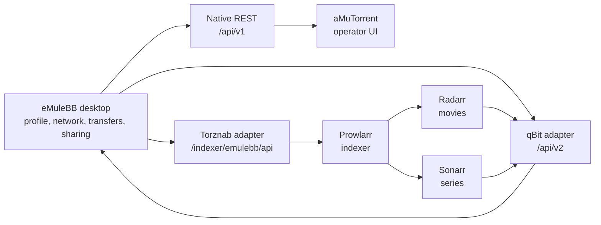
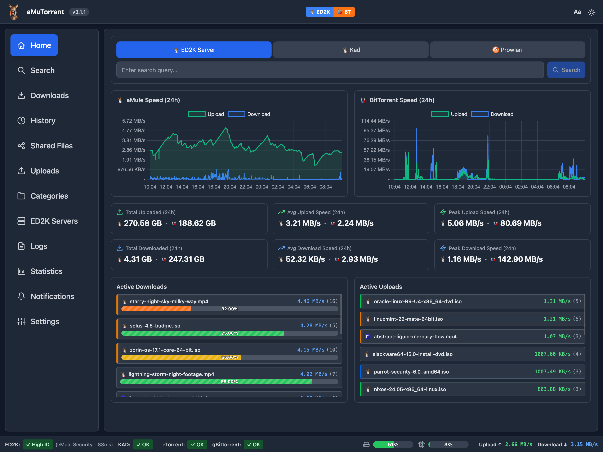
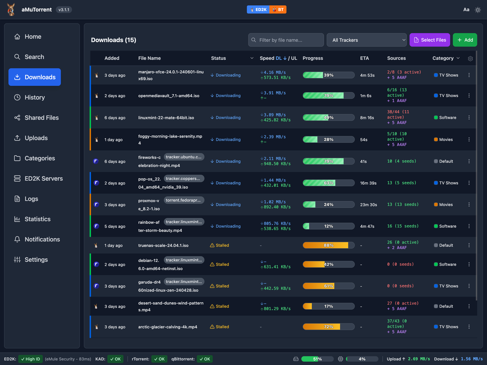
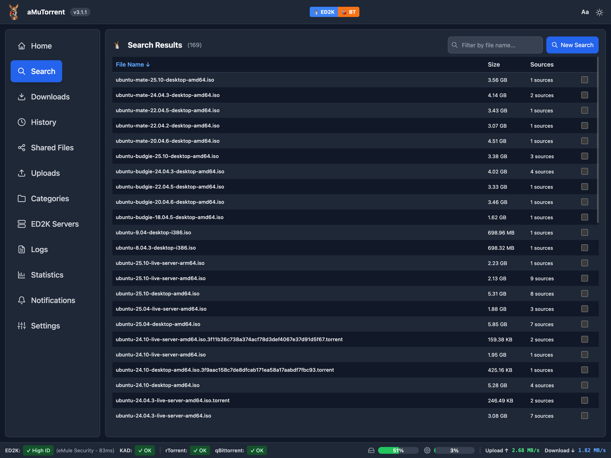
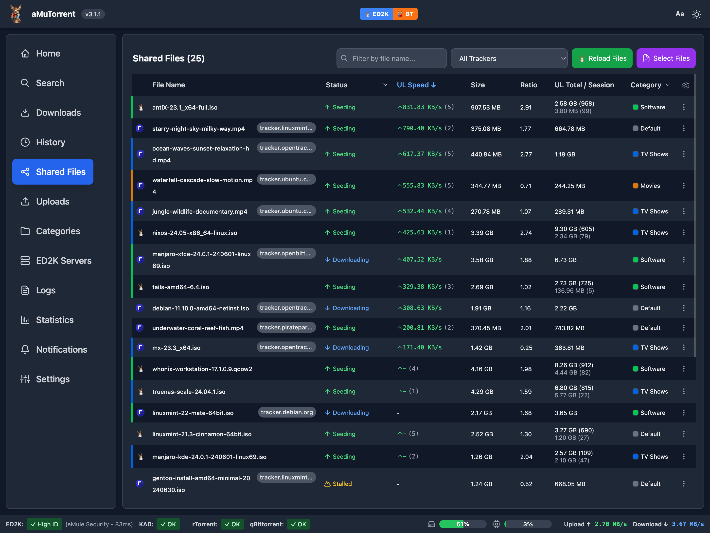

# eMuleBB Stack Integration Guide

This guide shows how to operate eMuleBB as part of a local power-user stack:
native eMuleBB for eD2K/Kad state, aMuTorrent for a modern controller UI, and
Prowlarr/Radarr/Sonarr for Torznab search and qBittorrent-compatible download
client workflows.

The goal is not to hide eMuleBB behind another tool. The native desktop app
owns identity, network state, categories, temp files, completed files, shared
files, and upload behavior. Controllers should make that state easier to use,
not flatten it into generic torrent semantics.

## Mental Model

| Layer | Owns | Talks To |
|---|---|---|
| eMuleBB desktop | Profile, eD2K/Kad, searches, transfers, sharing, logs | Native UI, REST, adapters |
| Native REST `/api/v1` | JSON automation, diagnostics, app state | aMuTorrent, scripts, custom tools |
| qBit adapter `/api/v2` | Arr download-client compatibility | Radarr, Sonarr, qBit-compatible probes |
| Torznab adapter `/indexer/emulebb/api` | Prowlarr/Radarr/Sonarr search bridge | Prowlarr Generic Torznab |
| aMuTorrent | Web controller and multi-client UI | eMuleBB REST and adapter surfaces |



Do the setup in that order. If eMuleBB is not healthy as a desktop client,
automation will only make failure modes harder to read.

## Visual Workflow

The current aMuTorrent fork already gives the stack a modern operator surface.
These screenshots are included to show the intended shape of the controller
experience; eMuleBB remains the native state owner behind it.

<div class="docs-screenshot-grid">
  <figure>
    
    <figcaption>Dashboard: one place to inspect connected clients and activity.</figcaption>
  </figure>
  <figure>
    
    <figcaption>Downloads: transfer state is controller-friendly but still comes from the native client.</figcaption>
  </figure>
  <figure>
    
    <figcaption>Search: eD2K/Kad results can be surfaced through controller workflows.</figcaption>
  </figure>
  <figure>
    
    <figcaption>Sharing: large libraries need explicit visibility and privacy decisions.</figcaption>
  </figure>
</div>

## Before You Start

Use a stable setup before adding controllers:

- eMuleBB starts and shuts down cleanly.
- The profile path is explicit, preferably through `emulebb.exe -c <profile-dir>`.
- `preferences.ini` is in the intended profile config directory:
  `<profile-dir>\config\preferences.ini`.
- Incoming and temp paths point where you expect.
- A small manual search works in the desktop app.
- A small manual download can be added, paused, resumed, and removed.
- Shared directories are deliberate and visible on the Shared Files page.
- WebServer/REST is enabled only on the intended bind address and port.

For an existing profile, start eMuleBB once without aMuTorrent, Prowlarr,
Radarr, Sonarr, or scripts. Let the app load the profile, resolve paths, and
write current sidecars before adding automation.

## Recommended Local Layout

Keep application binaries, profile state, and media storage separate.

| Location | Recommended Shape | Why |
|---|---|---|
| eMuleBB app | One unpacked package or local install directory per build | Rollback is simple. |
| Profile | Stable user-owned directory passed with `-c` | Identity and config are explicit. |
| Temp | Fast local disk with enough free space | `.part` files are write-heavy. |
| Incoming | Final storage path visible to Arr import if used | Completed files are predictable. |
| aMuTorrent | Separate package or service directory | Web UI updates do not mutate the eMuleBB profile. |
| Arr apps | Existing Radarr/Sonarr/Prowlarr installs | They own media import policy. |

Do not run two eMule-family clients against the same profile. Do not point
Radarr or Sonarr at eMuleBB temp directories for final import. They should see
completed files through the category/incoming paths reported by the adapter.

## Enable eMuleBB REST

1. Open `Preferences > Web Server`.
2. Enable the WebServer/REST listener.
3. Bind to `127.0.0.1` for same-machine controllers, or a deliberate LAN/VPN
   address for controlled-network controllers.
4. Choose the port. The examples below use `4711`; use your configured port.
5. Set a strong API key/password.
6. Keep Windows Firewall closed to unwanted clients.
7. If using HTTPS, generate or configure certificate files and make sure the
   controller trusts them.

Health check from the controller machine:

```powershell
$base = 'http://127.0.0.1:4711'
$key = '<emulebb-api-key>'
Invoke-RestMethod -Uri "$base/api/v1/app" -Headers @{ 'X-API-Key' = $key }
```

Expected result: a JSON response describing the app. If this fails, fix bind,
port, firewall, lifecycle, or API key before configuring any adapter.

## aMuTorrent

aMuTorrent should connect after native REST is healthy.

Use aMuTorrent when you want:

- a browser UI for search, transfers, shared files, history, and statistics
- one operator surface for multiple download clients
- a REST consumer that understands eMuleBB-specific state
- a safer place to experiment before enabling unattended Arr flows

Basic proof order:

1. Start eMuleBB with the intended profile.
2. Start aMuTorrent with eMuleBB integration enabled.
3. Confirm app status and preferences read correctly.
4. Confirm the search page can dispatch an eMuleBB search.
5. Confirm a selected result reaches eMuleBB as a native transfer.
6. Confirm transfer details, category, path, and queue data make sense.

If the aMuTorrent UI fails but direct `GET /api/v1/app` works, compare the UI
adapter assumptions with [REST API contract](../rest/REST-API-CONTRACT.md) and
[REST adapter notes](../rest/REST-API-ADAPTERS.md).

### Package Helper Script

Release packages include a helper that registers or repairs the eMuleBB client
entry in a compatible aMuTorrent instance through aMuTorrent's config API:

```powershell
.\scripts\register-amutorrent.ps1 `
  -AmutorrentUrl 'http://localhost:4000' `
  -AmutorrentApiKey '<amutorrent-admin-api-key>' `
  -EmulebbBaseUrl 'http://127.0.0.1:4711' `
  -EmulebbApiKey '<emulebb-api-key>'
```

Use `-Action Unregister` to remove the matching aMuTorrent eMuleBB client. The
helper refuses to edit entries owned by `EMULEBB_*` environment variables and
refuses to remove the last enabled aMuTorrent download client. Leave
`-AmutorrentApiKey` blank only when aMuTorrent authentication is disabled.

## Prowlarr Indexer Setup

Use this when Prowlarr should search eMuleBB through the Torznab adapter.

Current eMuleBB packages expose two setup paths:

- Manual fields, which are the most transparent way to prove the first setup.
- Tools menu launchers that start the bundled helper scripts with the current
  local eMuleBB base URL and API key.

The Tools launchers are convenience wrappers around scripts, not the future
guided setup tracked by `FEAT-089`. They still require the operator to provide
Prowlarr, Radarr, or Sonarr URLs and API keys at runtime.

### Manual Fields

In Prowlarr, add an indexer:

1. Go to `Settings > Indexers`.
2. Add `Generic Torznab`.
3. Fill the fields below.
4. Test, then save.

| Field | Value |
|---|---|
| Name | `eMuleBB` |
| Enable RSS | Usually off for first proof |
| Enable Automatic Search | Optional; leave off until manual search works |
| Enable Interactive Search | On |
| Base URL | `http://HOST:PORT/indexer/emulebb` |
| API Path | `/api` |
| API Key | eMuleBB REST/Web API key |
| Categories | `2000`, `5000`, and any intentional general categories |

Category choices:

| Category | Use |
|---|---|
| `2000` | Movie/video search workflows |
| `5000` | TV/video search workflows |
| `7000` | Document/general validation where your Arr setup expects it |

Health check before opening Prowlarr:

```powershell
$base = 'http://127.0.0.1:4711'
$key = '<emulebb-api-key>'
Invoke-WebRequest -Uri "$base/indexer/emulebb/api?t=caps&apikey=$key"
```

Expected result: XML, not JSON. A `401` means the key is wrong or missing. A
`503` usually means eMuleBB is not ready, the native API key is not configured,
or the search bridge is busy.

### Package Helper Script

Release packages include a helper script under `eMule\scripts`:

```powershell
.\scripts\register-prowlarr.ps1 `
  -ProwlarrUrl 'http://localhost:9696' `
  -ProwlarrApiKey '<prowlarr-api-key>' `
  -EmulebbBaseUrl 'http://127.0.0.1:4711' `
  -EmulebbApiKey '<emulebb-api-key>'
```

The helper creates or updates a Prowlarr Generic Torznab indexer named
`eMuleBB`. It does not make Prowlarr mandatory, and it should not store
Prowlarr credentials in eMuleBB preferences.

From the desktop app, use
`Tools > Controllers and Integrations > Register eMuleBB in Prowlarr...` to
launch this helper with the current local eMuleBB connection details already
filled in.

## Radarr And Sonarr Download Client Setup

Use this when Radarr or Sonarr should send selected releases to eMuleBB and
track them through the qBittorrent-compatible adapter.

Add a qBittorrent download client in Radarr or Sonarr:

| Field | Radarr Value | Sonarr Value |
|---|---|---|
| Name | `eMuleBB` | `eMuleBB` |
| Enable | On | On |
| Host | eMuleBB host, for example `127.0.0.1` | eMuleBB host |
| Port | eMuleBB WebServer/REST port, for example `4711` | Same |
| Use SSL | On only if eMuleBB listener uses HTTPS | Same |
| URL Base | Empty | Empty |
| Username | `emule` | Same |
| Password | eMuleBB REST/Web API key | Same |
| Category | `emulebb-radarr` | `emulebb-sonarr` |
| Initial State | Start | Start |
| Remove Completed | Off for first proof | Off for first proof |
| Remove Failed | Off for first proof | Off for first proof |

Then test the download client. A successful test proves only the qBit adapter
login and basic route shape. It does not prove that search, category paths,
completed-file import, or delete semantics are correct.

The qBittorrent-compatible endpoint is intentionally an eMuleBB/eD2K subset.
It accepts Torznab-emitted `ed2k://` URLs through the qBit-shaped add route; it
does not accept `.torrent` file uploads, BitTorrent magnet links, HTTP torrent
URLs, tracker/RSS APIs, or generic qBittorrent peer-management workflows. This
keeps Arr integration on the native eMule network model instead of pretending
that eMuleBB is a full BitTorrent client.

### Package Helper Script

Release packages include a shared helper that registers one selected Arr
target per invocation:

```powershell
.\scripts\register-arr-stack.ps1 `
  -Target Radarr `
  -EmulebbBaseUrl 'http://127.0.0.1:4711' `
  -EmulebbApiKey '<emulebb-api-key>' `
  -ProwlarrUrl 'http://localhost:9696' `
  -ProwlarrApiKey '<prowlarr-api-key>' `
  -RadarrUrl 'http://localhost:7878' `
  -RadarrApiKey '<radarr-api-key>'
```

Run it separately for Sonarr:

```powershell
.\scripts\register-arr-stack.ps1 `
  -Target Sonarr `
  -EmulebbBaseUrl 'http://127.0.0.1:4711' `
  -EmulebbApiKey '<emulebb-api-key>' `
  -ProwlarrUrl 'http://localhost:9696' `
  -ProwlarrApiKey '<prowlarr-api-key>' `
  -SonarrUrl 'http://localhost:8989' `
  -SonarrApiKey '<sonarr-api-key>'
```

The script can:

- register optional Prowlarr application sync for the selected target
- trigger Prowlarr application indexer sync when Prowlarr details are supplied
- add or update the selected target's qBittorrent-compatible download client

Use `-Target Radarr` for Radarr or `-Target Sonarr` for Sonarr. Leave the
Prowlarr URL blank when you want to skip Prowlarr sync for that run.

From the desktop app, use
`Tools > Controllers and Integrations > Register Radarr integration...` or
`Tools > Controllers and Integrations > Register Sonarr integration...` to
launch this helper with the current local eMuleBB connection details already
filled in.

## Adapter Compatibility Boundaries

The adapters are compatibility subsets for Arr workflows, not full clones of
qBittorrent or a generic Newznab provider.

| Surface | Supported | Not supported or no-op |
|---|---|---|
| qBit app/auth | Web API version, app version, login, minimal preferences | Full qBit settings management |
| qBit categories | List and create native eMuleBB categories | Torrent label semantics beyond category mapping |
| qBit transfers | Info, properties, files, add eD2K link, pause/resume/start/stop/delete | `.torrent` uploads, BitTorrent magnet links, HTTP torrent URLs, RSS, trackers, peer management, sync, ban lists, `hashes=all` |
| qBit policy routes | `setsharelimits`, `topprio`, and `setforcestart` validate input | They are accepted no-ops; eMuleBB has no torrent seeding policy |
| Torznab caps/search | `caps`, `search`, `tvsearch`, and `movie` | Provider-specific extensions beyond ignored safe parameters |

Torznab search is deliberately bounded. Generic searches observe native results
for about 12 seconds. Movie and TV searches observe for about 45 seconds because
they combine broader video results from connected networks. If the bridge is
already busy and no useful cached page exists, Arr clients receive `503` and
should retry with backoff. Offset pages use cached first-page results instead of
starting another native eMuleBB search.

## Path And Category Discipline

Most Arr integration failures are path failures, not API failures.

Use stable categories:

| Category | Owner | Purpose |
|---|---|---|
| `emulebb-radarr` | Radarr | Movie acquisitions |
| `emulebb-sonarr` | Sonarr | TV acquisitions |
| User categories | eMuleBB operator | Manual downloads or sharing workflows |

Rules:

- Keep Radarr and Sonarr categories separate.
- Make sure each category resolves to an incoming/completed path that the
  matching Arr app can read.
- Do not point Arr import at eMuleBB temp files.
- Do not use a broad shared root as an Arr import directory unless you intend
  completed downloads to land there.
- If containers or remote machines see paths differently, configure Arr remote
  path mappings. eMuleBB reports the path it knows; Arr must translate it.

For a Windows host and local Arr services, prefer normal drive-letter paths that
both processes can access. For Docker or VM controllers, map the same host
directory to predictable paths and test with one completed file before enabling
automatic import.

## Search And Acquisition Flow

Manual proof flow:

1. In eMuleBB, confirm connected eD2K or Kad state.
2. In Prowlarr, test the `eMuleBB` Generic Torznab indexer.
3. In Radarr or Sonarr, run an interactive search.
4. Pick one result that is safe and expected for the test profile.
5. Add it through the `eMuleBB` qBittorrent-compatible download client.
6. Watch the transfer appear in eMuleBB.
7. Confirm the transfer appears in Radarr/Sonarr queue.
8. Confirm the reported category and path match your import plan.
9. Let completion/import run only after the path is proven.

Do not judge search quality from one query. eD2K/Kad search depends on network
state, source availability, category mapping, file type, fake/trust signals, and
whether the query is broad enough for the network.

## Security Rules

- Treat eMuleBB, Prowlarr, Radarr, Sonarr, and aMuTorrent API keys as secrets.
- Do not paste API keys into public issues, logs, screenshots, or chat.
- Bind REST to localhost unless a controlled LAN/VPN path is intentional.
- Use firewall rules that match the bind policy.
- Avoid broad HTTPS exposure. HTTPS protects transport; it does not make an
  untrusted exposure safe.
- Prefer separate API keys per tool when the owning tool supports it.
- Redact live media titles, private paths, and API keys in diagnostic bundles.

## Troubleshooting

| Symptom | Likely Cause | First Check |
|---|---|---|
| Prowlarr returns `401` | Wrong eMuleBB API key | Test `/indexer/emulebb/api?t=caps&apikey=...` directly |
| Prowlarr returns `503` | eMuleBB not ready or search bridge busy | Check desktop lifecycle and REST `/api/v1/app` |
| Radarr/Sonarr qBit test fails | Host, port, SSL, URL base, or password mismatch | Test `/api/v2/app/webapiversion` and login route |
| Search works but add fails | qBit adapter rejected the link or category | Check adapter response body and eMuleBB logs |
| Transfer appears but import fails | Arr cannot see the completed path | Fix category path or remote path mapping |
| Downloads land in the wrong folder | Category path mismatch | Verify eMuleBB category path and Arr category field |
| Controller loops during startup | Mutations before eMuleBB lifecycle is ready | Add bounded retry with backoff |
| API helper script says unauthorized | Wrong target app API key, not eMuleBB key | Recheck which prompt is asking for which key |

For a support report, include:

- eMuleBB package version and architecture
- profile type: new, copied, or live profile
- eMuleBB base URL with host and port, but no API key
- whether WebServer/REST uses HTTP or HTTPS
- controller name and version
- exact route/status/body for failed API calls
- redacted category names and paths when path mapping is relevant
- eMuleBB logs and diagnostic snapshot with secrets removed

## What Not To Automate First

Avoid enabling these until the basic flow is proven:

- automatic search in Prowlarr/Radarr/Sonarr
- remove-completed behavior
- broad shared-directory reloads
- batch destructive transfer deletes
- REST mutations during app startup
- scripts that retry without backoff
- running multiple clients against the same eMuleBB profile

Once the manual flow works, automation should be boring: bounded retries,
explicit categories, predictable paths, and clear logs.

## Related Docs

- [Product Guide](GUIDE-EMULEBB.md)
- [Setup Guide](GUIDE-SETUP.md)
- [Controllers And REST Guide](GUIDE-CONTROLLERS-REST.md)
- [REST API contract](../rest/REST-API-CONTRACT.md)
- [REST adapter notes](../rest/REST-API-ADAPTERS.md)
- [Troubleshooting Guide](GUIDE-TROUBLESHOOTING.md)
